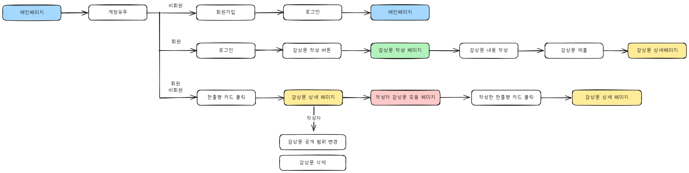
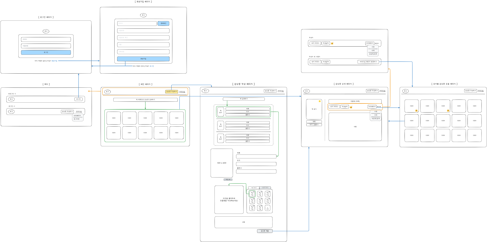

# 📌 Book Review


## 📖 프로젝트 개요

### a. 프로젝트 소개

- 주제 : 카드 기반 감상문 공유 프로젝트
- 도메인 : https://52.79.68.247.sslip.io/ (03.08 종료)
- 개발기간 : 2025.02.19~2025.03.06 (약 2주)
- 개발인원 : 4인

### b. 프로젝트 목적 및 주요 기능

- 독서 경험 공유와 소통을 위한 온라인 플랫폼 제공
- 개인화된 독서 기록 및 감상문 관리 시스템 구축
- 주요 기능: 감상문 관리, 카드 형식의 감상문 접근, 도서 검색, 사용자 중심 리뷰 모음

### c. 문제 정의 및 타겟

- 기존 플랫폼의 한계: 통합적 감상문 관리 부재, 감상문 접근 방식 단조로움
- 독자 간 연결성 부족 및 새로운 도서 발견 기회 제한
- 타겟: 독서 경험 공유 희망자, 다양한 관점 탐색자, 새로운 도서/독서 친구 발견 희망자

## 🛠 기술 스택

- **프론트엔드**: ****React, Redux
- **백엔드**: Spring Boot
- **데이터베이스**: MySQL
- **인프라**: Docker, AWS(EC2, S3)

## 👨‍👩‍👧‍👦 유저 플로우



- 메인페이지로 부터 회원/비회원에 따른 흐름을 구성하였습니다.

## 🖼️ 와이어 프레임



- 4가지로 분류 됩니다
    - 가입 페이지, 메인 페이지, 감상문 작성 페이지, 유저 페이지
> 도구: Obsidian - Excalidraw


## ⚙️ 설치 및 실행 방법

### 1. 필수 요구 사항

- Java 21
- Docker Desktop
- npm

### 2. 실행 방법

### 사전준비

### 공통 사항

- Docker Desktop
- AWS 계정
- S3
    - `access-key`, `secret-key`
    - IAM → 사용자 → 보안 자격 증명 → 액세스 키 → 로컬 코드
- 책 데이터(Python 코드를 실행시켜 DB에 저장)
- 프로젝트 `clone`
- 디스코드 웹훅 URL

### 배포 환경

- EC2
    - `t2.micro` 이상
        - 단. RDS를 사용하지 않으므로 `t2.micro` 의 경우 멈출 수 있음(RAM 부족)
    - Docker
        
        ```json
        설치 코드~~~
        ```
        
    - SSL 인증(HTTPS)
        
        **인증서 발급**
        
        - 무료 SSL 인증서 발급 기관인 **Let's Encrypt**을 활용한다.
        1. 원격 서버 - 패키지 설치
            - certbot - Let's Encrypt 인증서 발급 도구
            
            ```bash
            sudo apt update
            sudo apt install -y certbot
            ```
            
        2. 원격 서버 - 개인 키와 인증서 생성
            
            ```bash
            sudo certbot certonly --standalone -d ***[Public IPv4]***.sslip.io
            ```
            
        3. 원격 서버 - Let’s Encrypt 인증서 발급 과정
            1. Enter email address - **`이메일 작성`**
            2. Please read the Terms of Service at - 서비스 약관 동의 여부 → **`Y`**
            3. Would you be willing, … - 뉴스레터 구독 여부 → **`N`**
            4. 인증서 생성 확인
                
                ```bash
                sudo ls /etc/letsencrypt/live/도메인/
                ```
                
                - 아래 파일 확인
                    - /etc/letsencrypt/live/**`도메인`**/privkey.pem
                    - /etc/letsencrypt/live/**`도메인`**/fullchain.pem

### 로컬 실행(Docker compose)

- 프로젝트 루트 위치
- `.env.development.local.example` 을 `.env.development.local` 로 복사하여 **환경 변수 작성**
    - 샘플 환경 변수(S3의 키는 개인 발급)
        
        ```bash
        # Local
        
        # S3
        ACCESS_KEY=your-access-key
        SECRET_KEY=your-secret-key
        BUCKET_NAME=your-bucket-name
        REGION=ap-northeast-2
        
        # DB
        MYSQL_ROOT_PASSWORD=1q2w3e4r@
        MYSQL_DATABASE=book-review
        
        # Backend
        DATABASE_HOST=db-container
        DATABASE_PORT=3306
        DATABASE_NAME=book-review
        DATABASE_USERNAME=root
        DATABASE_PASSWORD=1q2w3e4r@
        JWT_SECRET=qg0hqJgqNtiFu/P4tCslwA==NLKXOy619FZ5d0KuwWZ9U7IjCjlVP2tO0FGtDqc
        SECURE=false
        CORS_ALLOWED_ORIGIN=http://localhost
        
        # Front
        VITE_API_URL=/api
        
        ```
        
- 명령어 실행(프로젝트 루트 위치)
    
    ```bash
    docker compose -f docker-compose-local.yml up --build
    ```
    

### 배포

- `Github.com/repository → settings → Secrets and variables → Actions → New repository secret`
    - `.env.example` 에 있는 환경 변수 등록
- 푸쉬 감지 후 깃허브 액션에서 `deploy.yml` 실행

## 📡 API 명세

- API 문서: [Notion 링크](https://www.notion.so/1afe41ab207980c79817efa42f101f3d?pvs=21)
- 분류 : 회원, 감상문, 도서, 이미지
- 개수 : 15개

## 🗂 ERD 다이어그램


## 📂 프로젝트 구조

```bash
📦book-review
 ┣ 📂.github                    # Github Actions 워크플로우
 ┣ 📂.husky                     # git commit 설정
 ┣ 📂document                   # ERD, Wire Frame
 ┣ 📂frontend                   # React
 ┣ 📂backend                    # Spring Boot
 ┣ 📂scrap                      # 책 정보 수집(Python)
 ┣ 📜.env                       # 배포용 환경변수
 ┣ 📜docker-compose.yml         # 배포용 Nginx, Spring Boot, MySQL 이미지 실행
 ┣ 📜.env.development.local     # 로컬용 환경변수
 ┗ 📜docker-compose-local.yml   # 로컬용 Nginx, Spring Boot, MySQL 이미지 실행
```

