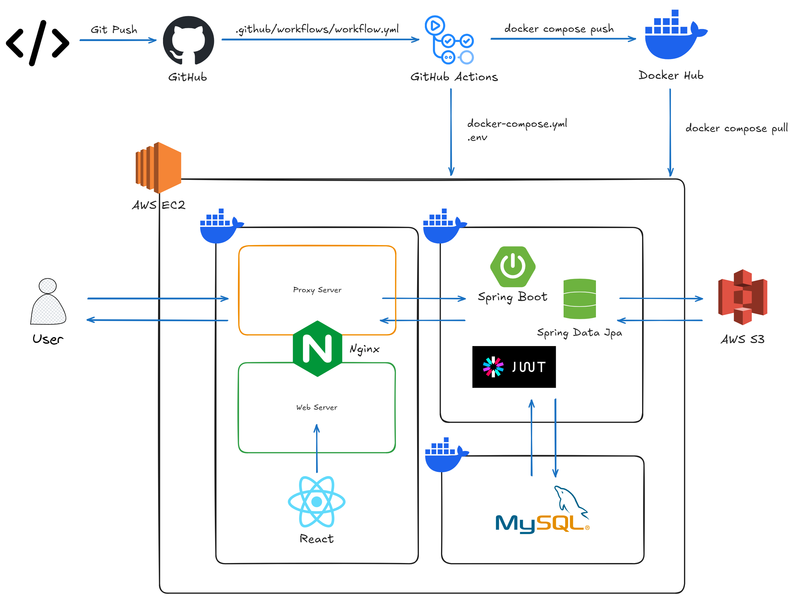
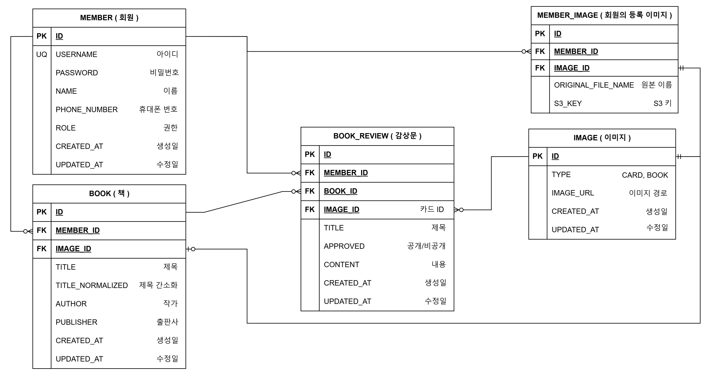

# 📌 Book Review

## 📹 시연 영상


## 📖 프로젝트 개요

### a. 프로젝트 소개

- 주제 : 카드 기반 감상문 공유 프로젝트
- 도메인 : ~~https://52.79.68.247.sslip.io/ (03.08 종료)~~
- 개발기간 : 2025.02.19~2025.03.06 (약 2주)
- 개발인원 : 4인

### b. 프로젝트 목적

- 독서 경험 공유 희망자

### c. 주요 기능

- 감상문 관리, 카드 형식의 감상문 접근, 도서 검색, 사용자 중심 리뷰 모음

## 🛠 기술 스택

- **프론트엔드**: <sub>React</sub> <sub>Redux</sub> <sub>Axios</sub>
- **백엔드**: <sub>Spring Boot</sub> <sub>Hibernate</sub>
- **데이터베이스**: 
- **인프라**: <sub>Github Actions</sub> <sub>Docker</sub> <sub>S3</sub> <sub>EC2</sub>
- **버전 및 이슈 관리**: <sub>Git, Git Hooks</sub> <sub>GitHub</sub> <sub>Jira</sub> <sub>Confluence</sub>

## 👨‍👩‍👧‍👦 유저 플로우


- 메인페이지로 부터 회원/비회원에 따른 흐름을 구성하였습니다.

## 🖼️ 와이어 프레임


- 4가지로 분류 됩니다
    - 가입 페이지, 메인 페이지, 감상문 작성 페이지, 유저 페이지
> 도구: Obsidian - Excalidraw

## 🖥️ 아키텍처


- 배포, 시스템, 네트워크(요청/응답) 흐름을 포함합니다.

## ⚙️ 설치 및 실행 방법

### 1. 필수 요구 사항

- Java 21
- Docker Desktop 27.4
- npm 10.8

### 2. 실행 방법

### 사전준비

### 공통 사항

- Docker Desktop
- AWS 계정
- S3
    - `access-key`, `secret-key`
    - IAM → 사용자 → 보안 자격 증명 → 액세스 키 → 로컬 코드
- [책 데이터(Python 코드를 실행시켜 DB에 저장)](scrap/README.md)
- 프로젝트 `clone`
- 디스코드 웹훅 URL


### 로컬 실행(Docker Compose)

- 프로젝트 루트 위치
- `.env.development.local.example` 을 `.env.development.local` 로 복사하여 **환경 변수 작성**
    - 샘플 환경 변수(S3의 키는 개인 발급)
        
        ```bash
        # Local
        
        # S3
        ACCESS_KEY=your-access-key
        SECRET_KEY=your-secret-key
        BUCKET_NAME=your-bucket-name
        REGION=ap-northeast-2
        
        # DB
        MYSQL_ROOT_PASSWORD=1q2w3e4r@
        MYSQL_DATABASE=book-review
        
        # Backend
        DATABASE_HOST=db-container
        DATABASE_PORT=3306
        DATABASE_NAME=book-review
        DATABASE_USERNAME=root
        DATABASE_PASSWORD=1q2w3e4r@
        JWT_SECRET=qg0hqJgqNtiFu/P4tCslwA==NLKXOy619FZ5d0KuwWZ9U7IjCjlVP2tO0FGtDqc
        SECURE=false
        CORS_ALLOWED_ORIGIN=http://localhost
        
        # Front
        VITE_API_URL=/api
        
        ```
        
- 명령어 실행(프로젝트 루트 위치)
    
    ```bash
    docker compose -f docker-compose-local.yml up --build
    ```
    

### 배포

- `Github.com/repository → settings → Secrets and variables → Actions → New repository secret`
    - `.env.example` 에 있는 환경 변수 등록
- 푸쉬 감지 후 깃허브 액션에서 `deploy.yml` 실행

> [프로젝트 환경 구축 상세](document/readme-file/deploy.md)

## 📡 API 명세

- API 문서: [Notion 링크](https://www.notion.so/1afe41ab207980c79817efa42f101f3d?pvs=21)
- 분류 : 회원, 감상문, 도서, 이미지
- 개수 : 15개

## 📜 ERD



## 📂 프로젝트 구조

```bash
📦book-review
 ┣ 📂.github                    # Github Actions 워크플로우
 ┣ 📂.husky                     # git commit 설정
 ┣ 📂document                   # ERD, Wire Frame
 ┣ 📂frontend                   # React
 ┣ 📂backend                    # Spring Boot
 ┣ 📂scrap                      # 책 정보 수집(Python)
 ┣ 📜.env                       # 배포용 환경변수
 ┣ 📜docker-compose.yml         # 배포용 Nginx, Spring Boot, MySQL 이미지 실행
 ┣ 📜.env.development.local     # 로컬용 환경변수
 ┗ 📜docker-compose-local.yml   # 로컬용 Nginx, Spring Boot, MySQL 이미지 실행
```

## 👥 팀 소개

| [박하은](https://github.com/apricity2u) | [육슬찬](https://github.com/ysc13245) | [임유진](https://github.com/cocobabb) | [이재현](https://github.com/CloakingGhost) | 
| :---: | :---: | :---: | :---: |
|  |  |  |  |


> **Contributor**<br>
> <a href="https://github.com/beemo-nodecrew"></a>


